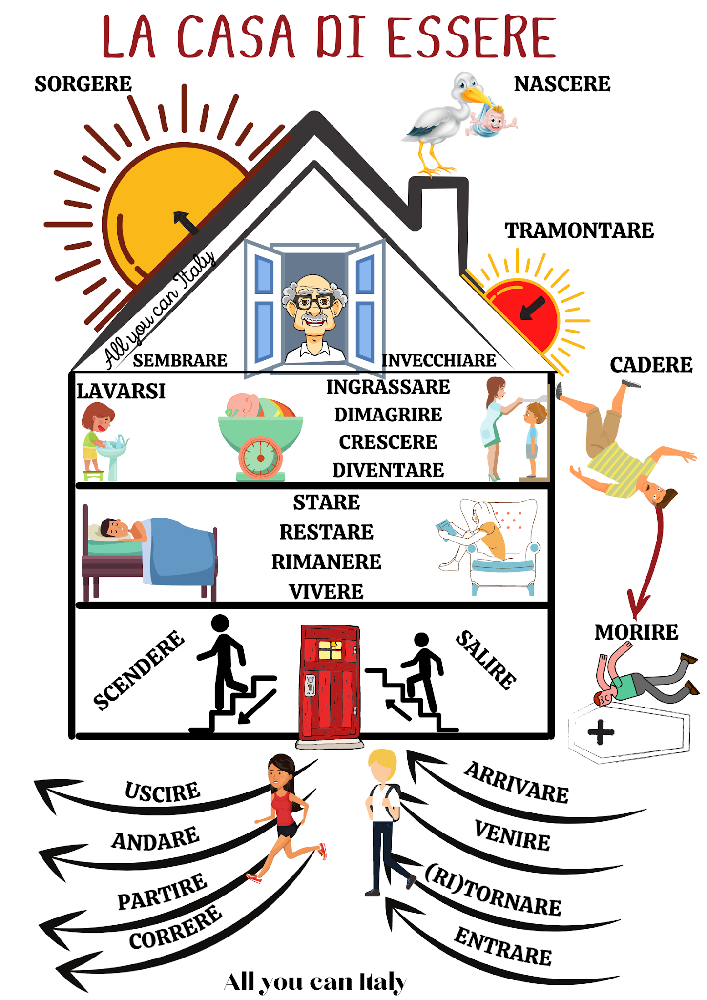

# Past Tense

Past indicative tenses such as the _present perfect_ and the _pluperfect_ are compound tenses, formed with an auxiliary verb plus the _past participle_ of of the verb, in that order.

## Past Participle

To form the past participle of regular verbs, drop the infinitive ending and add **-ato**, **-uto**, or **-ito**.

| Infinitive | Stem  | Participle | Meaning    |
|------------|-------|------------|------------|
| parlare    | parl- | parlato    | _spoken_   |
| vendere    | vend- | venduto    | _sold_     |
| finire     | fin-  | finito     | _finished_ |

## Present Perfect

The _present perfect_ tense is used to express simple actions completed at the present time.  It is formed with two auxiliary verbs, _avere_ and _essere_, conjugated in the present indicative.  

### Avere

| Pronoun   | Auxiliary | Participle | Meaning                              |
|-----------|-----------|------------|--------------------------------------|
| (io)      | ho        | parlato    | I have spoken, I spoke               |
| (tu)      | hai       | parlato    | You have spoken, you spoke           |
| (lui/lei) | ha        | parlato    | He/She has/have spoken, he/she spoke |
| (noi)     | abbiamo   | parlato    | We have spoken, we spoke             |
| (voi)     | avete     | parlato    | You have spoken, you spoke           |
| (loro)    | hanno     | parlato    | They have spoken, they spoke         |

### Essere

The past participle of verbs conjugated with _essere_ agrees in number and gender with the subject.

| Pronoun   | Auxiliary | Participle | Meaning                                   |
|-----------|-----------|------------|-------------------------------------------|
| (io)      | sono      | uscito/a   | I have gone out, I went out               |
| (tu)      | sei       | uscito/a   | You have gone out, you went out           |
| (lui/lei) | è         | uscito/a   | He/She has/have gone out, he/she went out |
| (noi)     | siamo     | usciti/e   | We have gone out, we went out             |
| (voi)     | siete     | usciti/e   | You have gone out, you went out           |
| (loro)    | sono      | usciti/e   | They have gone out, they went out         |

Verbs conjugated with _essere_:

| Infinitive  | Participle  | Meaning                 |
|-------------|-------------|-------------------------|
| andare      | andato      | to go                   |
| apparire    | apparso     | to appear               |
| arrivare    | arrivato    | to arrive               |
| cadere      | caduto      | to fall                 |
| correre     | corso       | to run                  |
| crescere    | cresciuto   | to grow                 |
| dimagrire   | dimagrito   | to lose wight           |
| diventare   | diventato   | to become               |
| entrare     | entrato     | to enter                |
| essere      | stato       | to be                   |
| lavarsi     | lavato      | to wash (oneself)       |
| morire      | morto       | to die                  |
| nascere     | nato        | to be born              |
| ingrassare  | ingrassato  | to fatten, gain wieght  |
| invecchiare | invecchiato | to age, grow old        |
| partire     | partito     | to leave                |
| restare     | restato     | to stay, remain (place) |
| rimanere    | rimasto     | to stay, remain (time)  |
| salire      | salito      | to climb, to go up      |
| sembrare    | sembrato    | to seem                 |
| scendere    | sceso       | to go down (stairs)     |
| sorgere     | sorto       | to arise, rise          |
| stare       | stato       | to stay                 |
| tornare     | tornato     | to go back, to return   |
| tramontare  | tramontato  | to set, go down         |
| uscire      | uscito      | to go out               |
| venire      | venuto      | to come                 |
| vivere      | vissuto     | to live                 |

## Imperfect

The _imperfect_ tense is used to express:

- actions that continued for an indefinite period of time
- habitual or repeated actions in the past
- characteristics of people and things as they used to be

To conjugate verbs in the _imperfect_ tense drop **-re** from infinitive endings.

| Infinitive | Stem    |
|------------|---------|
| parlare    | parla-  |
| scrivere   | scrive- |
| finire     | fini-   |

Then add the following to the stem:

| Pronoun   | Ending |
|-----------|--------|
| (io)      | -vo    |
| (tu)      | -vi    |
| (lui/lei) | -va    |
| (noi)     | -vamo  |
| (voi)     | -vate  |
| (loro)    | -vano  |

Here are the results:

| Pronoun   | First (-are) | Second (-ere) | Third (-ire) |
|-----------|--------------|---------------|--------------|
| (io)      | parlavo      | scrivevo      | finivo       |
| (tu)      | parlavi      | scrivevi      | finivi       |
| (lui/lei) | parlava      | scriveva      | finiva       |
| (noi)     | parlavamo    | scrivevamo    | finivamo     |
| (voi)     | parlavate    | scrivevate    | finivate     |
| (loro)    | parlavano    | scrivevano    | finivano     |

[Past Tense Irregular Conjugations](tenses-past-irregular.md)
